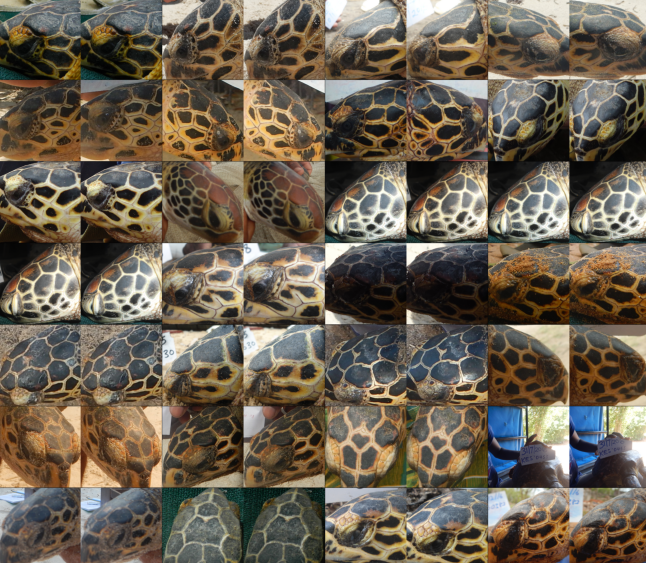

# Portfolio
---

## Tracking with particle swarm optimization

<div style="text-align: justify">
In this project I am going to perform tracking with
</div>


## Turtle Recall Classification: Data cleaning

[](projects/turtle_recall_data_cleaning.html)

<div style="text-align: justify">
In order to classify different turtles, was necessary to clean the data of possibly duplicate or outliers images.
First, I used different pre-trained models as Resnet-101 and Resnet-152 to get average of the embeddings of the same class and discard embeddings with high cosine similarity (duplicate) or low cosine similarity (outliers).
</div>

<center></center>


```markdown
Syntax highlighted code block

# Header 1
## Header 2
### Header 3

- Bulleted
- List

1. Numbered
2. List

**Bold** and _Italic_ and `Code` text

[Link](url) and 
```

For more details see [Basic writing and formatting syntax](https://docs.github.com/en/github/writing-on-github/getting-started-with-writing-and-formatting-on-github/basic-writing-and-formatting-syntax).

### Jekyll Themes

Your Pages site will use the layout and styles from the Jekyll theme you have selected in your [repository settings](https://github.com/marcell-llerena/marcell-llerena.github.io/settings/pages). The name of this theme is saved in the Jekyll `_config.yml` configuration file.

### Support or Contact

Having trouble with Pages? Check out our [documentation](https://docs.github.com/categories/github-pages-basics/) or [contact support](https://support.github.com/contact) and we’ll help you sort it out.
