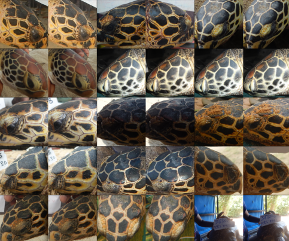

# Portfolio
---

## Trailblazers Qualification Challenge

<h3><a href="https://zindi.africa/competitions/turtle-recall-conservation-challenge">Challenge hosted by Zindi</a></h3>

The objective of this challenge is to build a predictive model that accurately estimates the percentage of households per ward that are female-headed and living below a particular income threshold, by using data points that can be collected through other means without an intensive household survey like the census.
As start point to resolve this challenge: I made an exploratory data analysis (EDA) in order to get most representative features and train a basic random forest regressor.

    

## Detection and classification with deep learning

Try to detect and classify when a potential risk dog has not a muzzle, can avoid
future attacks against other dogs or pedestrians. In that sense, in this project
I used a faster R-CNN pre-trained on COCO dataset to detect dogs, and other model to classify if a dog has or no muzzle.
The second model uses EfficientNet as feature extractor and a classifier is trained from scratch. The performance at the moment is quite encouraging.

    

---

## Tracking with particle swarm optimization

In this project, I am going to perform tracking based on color using particle swarm optimization.
Nowadays, deep learning beat classic methods to tracking, but it is worth how heuristics work to this particular challenge.

    

---

## Turtle Recall Classification: Data cleaning

<h3><a href="https://zindi.africa/competitions/turtle-recall-conservation-challenge">Challenge hosted by Zindi and DeepMind</a></h3>

In order to classify different turtles, was necessary to clean the data of possibly duplicate or outliers images.
First, I used different pre-trained models as Resnet-101 and Resnet-152 to get average of the embeddings of the same class and discard embeddings with high cosine similarity (duplicate) or low cosine similarity (outliers).

    

---